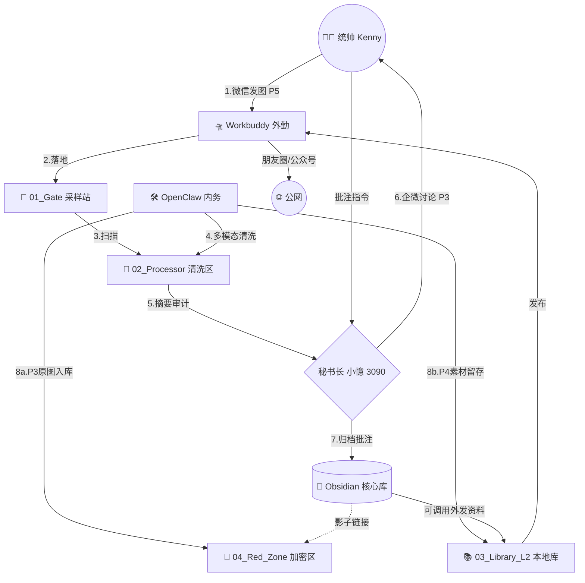

---

# 🏛️ 内阁 108节点 (Windows) 小报系统工作说明书 (v2.2)

## 1. 节点定位与核心逻辑

- **节点名称**：108节点 (Windows 工作站)
    
- **功能属性**：内阁的**“感官”**（多模态获取）与**“肢体”**（外部文件咨询整理与外发）,
    
- **核心逻辑**：
    
    - **高频交互**：由 Workbuddy(windows微信agent) 负责公网/微信采样。
        
    - **多模态脱水**：由 OpenClaw (windows本地agent)调用云端/本地算力，将影像同步为 3090 本地算力可读的 Markdown。并由本地算力审核素材等级,采用不同级的存储策略.
    - 3090 只存储 markdown 文本于obsidian, 多媒体存于 windows
        
    - **影像重构**：由windows 端 ComfyUI 为未来的影像处理与脱敏打下基础。
        

---

## 2. 系统架构流程 (Mermaid)

代码段

---

## 3. 双体系角色职责说明

### 🛸 Workbuddy (外勤/交互 Agent)

- **核心任务**：采样 (Capture) 与 发布 (Publish)。
    
- **技术栈**：个人微信协议、云端多模态 API（用于初步理解交互内容）。
    
- **运行准则**：
    
    - **禁止触碰红区**：无法读取 `04_Red_Zone` 目录。
        
    - **单向落地**：抓取内容必须立即存入 `01_Gate` 并移交控制权给 OpenClaw。
    - 获得脱敏kenny 用户画像与 agent soul
    
        

### 🛠️ OpenClaw (内务/理货 Agent)

- **核心任务**：分拣 (Sort)、清洗 (Clean) 与 归档 (Archive)。
    
- **技术栈**：本地文件系统权限、ComfyUI 接口、3090 局域网通讯。
    
- **运行准则**：
    
    - **多模态前置**：利用云端或本地 ComfyUI 算力将图片/PDF 转化为结构化 MD。
        
    - **安全分流**：根据 3090 审计结果，将原始高价值影像存入 108节点 加密隔离区。
    - 负责windows 站的 文档存储与管理 (各级 多媒体/  低级别 markdown )
    - 在windows 端 多媒体 文档只有内容, 没有索引, 高级别文档索引只存在于 3090 obsidian 中
        

---

## 4. 108节点 标准化目录结构

|**目录名称**|**权限控制**|**存放内容说明**|
|---|---|---|
|`[01_Gate]`|WB(W), OC(R)|原始采样区，存放从微信/网页抓取的 P5 级生肉。|
|`[02_Processor]`|OC(RW)|影像脱水区，ComfyUI 与云端 API 在此生成 MD 摘要。|
|`[03_Library_L2]`|OC(RW), WB(R)|**多媒体/Obsidian 本地库**。存放 P4/P5 调研素材及外发物料。|
|`[04_Red_Zone]`|OC(RW), 3090(R)|**P3 加密隔离区**。存放与核心库关联的原始高敏感多媒体。|
|`[05_PostOffice]`|WB(R), 3090(W)|待发布区。3090 定稿后的图文在此由 Workbuddy 读取外发。|

---

## 5. 核心协同准则

1. **脱水原则**：所有多模态内容（图/影/PDF）必须在 108节点 完成“脱水”处理。3090 仅接收纯文本 MD 或结构化 JSON，以节省显存。
    
2. **影子链接**：3090 的 Obsidian 库中仅保存多媒体的**逻辑索引**。当统帅需要查看高清原件时，由 108节点 本地唤起预览。
    
3. **外发闭环**：当 3090 决策发布任务时，指令下达到 108节点，由 OpenClaw 从 `03_Library_L2` 提取素材，配合 Workbuddy 完成公网投递。
    

---

