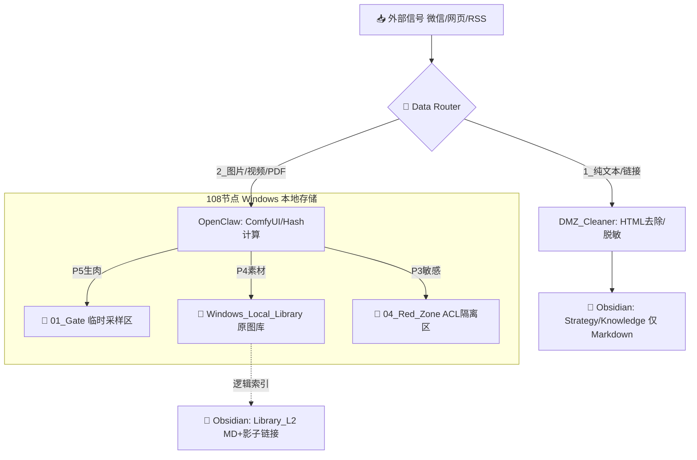

---

# 📜 小报系统运行规范 v1.5 (融合版)
**版本**: `v1.5`  
**状态**: **Draft **(待审计/确认)  
**关联文档**: [[00_Cabinet_System/Agent/小报/Windows小报工作说明书]] (`v2.2`)

---

## 一、系统目标与架构演进 (System Goals & Evolution)

### 🎯 核心使命
构建一个 **全功能多模态情报节点**，在确保本地数据主权的前提下，实现对外部信息的自动搜索、整理与分析。

> **关键升级**: 
> - **v1.0 **(单模): 仅处理文本流 (Text-Only DMZ)。
> - **v1.5 **(双路融合): 引入 **中间态缓冲** (`Windows Local Lib`)，允许多媒体暂存与“脱水”处理，Obsidian 仅接收结构化索引。

### 🏗️ 架构拓扑：动态路由模型
系统不再是一个单一的管道，而是一个具备 **“分流能力”**的智能节点。所有外部输入根据内容类型被自动分发至不同路径。

---

## 二、核心原则 (Core Principles)

1.  **主权优先 **(Sovereignty First): 
    -   `Obsidian` (`AI-OB`) 永远只存储文本索引与逻辑关系。
    -   所有多媒体资产（原图/视频）物理存储在 Windows 本地或加密区，严禁上传公有云或非授权节点。

2.  **中间态缓冲 **(Intermediate Buffering): 
    -   `03_Library_L2` (本地素材库) 作为“中间态”，承担重资产存储与渲染任务。
    -   Obsidian 通过 **“影子链接”** 引用该区域，实现“轻脑重肢”的架构平衡。

3.  **动态路由 **(Dynamic Routing): 
    -   Agent 具备感知能力：检测到图片/PDF $\rightarrow$ 触发 Windows 端多模态处理流程；
    -   检测到纯文本/链接 $\rightarrow$ 触发 DMZ 文本清洗流程。

4.  **Human-in-the-Loop**: 
    -   无论何种路径，最终进入 `00_Cabinet` (战略库) 的内容必须经过人工审核（A/B/C/D级）。

---

## 三、数据流向与目录定义 (Data Flow & Directory Definitions)

### 🗂️ 关键目录权限矩阵
| **目录名称** | **物理位置** | **存储内容** | **Obsidian **(OB) | **Windows Agent **(OC/WB) | **安全等级** |
| :--- | :--- | :--- | :---: | :---: | :--- |
| `01_Gate` | Windows 本地 | P5级原始采样 (生肉) (待清洗的多媒体/文本) | ❌ No Access (仅逻辑映射) | 🛠️ RW / WB R+W | **P4 **(中敏) |
| `02_Processor` | Windows 本地 | ComfyUI/Meta处理中间态 MD摘要生成区 | ❌ No Access | 🛠️ RW | **P3 **(高敏/内务) |
| `03_Library_L2` (**中间态**) | Windows 本地 | P4级调研素材、外发物料、原图库 | 👁️ Read Only **影子链接** (Shadow Link) *(点击唤起预览)* | 🛠️ RW / WB R+W | **P3/P4 **(分级) |
| `04_Red_Zone` (加密区) | Windows 本地/网络盘 | P3级高敏感数据 (需严格审计的原始文件) | ❌ No Access *(仅元数据索引)* | 🛠️ RW (ACL受限) *WB禁止* | **P1 **(绝密) |
| `05_PostOffice` | Windows 本地/网络盘 | 待发布区 (定稿图文) | 👁️ Read Only | WB R+W OC RW | **Public** |

---

## 四、工作流规范 (Workflow Protocols)

### 🔄 流程 A: 文本情报流 (Text Intelligence Stream)
*适用于新闻摘要、论文阅读、RSS聚合。严格遵循 v1.0 DMZ 原则，但路由至 OB。*

1.  **采集**: `Workbuddy` 抓取链接/纯文本内容 $\rightarrow$ 写入临时缓冲区。
2.  **净化**: 
    -   去除 HTML 标签、脚本代码、追踪参数。
    -   *安全*: 禁止任何二进制数据流入此路径。
3.  **分析**: `XiaoBao` Agent (DMZ环境) 生成结构化摘要 (`Signal`).
4.  **归档**: 
    -   审核通过 $\rightarrow$ 写入 Obsidian `Strategy/Knowledge`.
    -   *日志*: 记录至 Audit Log。

### 🔄 流程 B: 多模态感官流 (Multimodal Sensory Stream)
*适用于朋友圈截图、现场照片、产品草图、视频片段。遵循 v2.2 Windows Agent 原则，利用中间态缓冲。*

1.  **采样**: `Workbuddy` 捕获多媒体文件 $\rightarrow$ 立即写入 `01_Gate`.
    -   *约束*: WB 无权读取后续目录 (`Proc`, `Lib`, `Red`).
2.  **脱水与分流** (OpenClaw): 
    -   **哈希计算**: 生成唯一指纹。
    -   **ComfyUI 处理**: 将图片/PDF转化为 MD 描述（OCR/视觉摘要）。
    -   **分级决策**:
        -   P5 $\rightarrow$ `03_Library_L2` (普通素材).
        -   P4 $\rightarrow$ `03_Library_L2` + Obsidian 影子链接。
        -   P3 $\rightarrow$ `04_Red_Zone`.
3.  **索引生成**: 
    -   MD 摘要写入 Obsidian (`Library_L2`).
    -   *关键点*: Obsidian **不存储**原图，仅存路径映射 (Shadow Link)。

### 🔄 流程 C: 发布闭环 (Publish Loop)
1.  `XiaoBao` / Kenny 审核通过内容。
2.  指令下发至 Windows Agent (`05_PostOffice`).
3.  OpenClaw 从 `Lib` 提取素材，配合 WB 完成公网投递（朋友圈/公众号）。

---

## 五、安全与审计 (Security & Audit)

### 🛡️ 数据主权保护机制
1.  **物理隔离**: 
    -   Obsidian Vault (`AI-OB`) 不直接挂载 Windows 多媒体目录。
    -   `04_Red_Zone` 通过 NTFS ACL/Docker Mounts 实现硬性读写限制 (仅 OC/小酷可写)。
2.  **影子链接安全**: 
    -   Obsidian 中的图片引用必须是**逻辑路径**。若原文件被删除，Obsidian 需自动标记为“失效”，而非显示乱码。
3.  **中间态清理策略**: 
    -   `01_Gate` / `02_Processor`: 建议每日定时归档或清洗（由小酷配置 Cron Job）。

---

