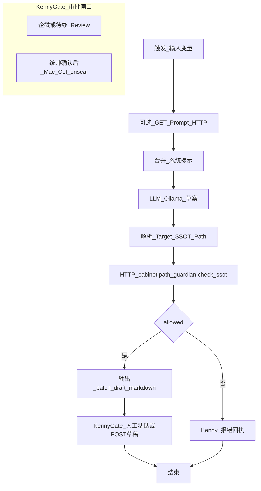

# WF_InboxRefine_Patch（设计真源）

> **L2**：须遵守 [`Manuals/Dify_应用开发规范.md`](file:///Volumes/Cabinet/cabinet/obsidian_vault/000_Cabinet_System/Manuals/Dify_%E5%BA%94%E7%94%A8%E5%BC%80%E5%8F%91%E8%A7%84%E8%8C%83.md)。控制台配置与导出 JSON 为派生产物。  
> **Prompt 真源**：[`Agent/小忆/小忆_L2_inbox_enseal_patch.md`](file:///Volumes/Cabinet/cabinet/obsidian_vault/000_Cabinet_System/Agent/%E5%B0%8F%E5%BF%86/%E5%B0%8F%E5%BF%86_L2_inbox_enseal_patch.md)（HTTP 拉取见 TOOLS `prompt_http_bridge.py`）。

## Mermaid（逻辑）

## Skill Map（经 Mac 薄 API / skill_manager）

| 技能键 | 用途 |
|--------|------|
| `cabinet.path_guardian.check_ssot` | 校验 `Target_SSOT_Path` 相对路径 |
| （可选）`cabinet.dialog.inbox_list` | 列举待炼化会话 |

**铁律**：调用 `skill_manager` 时 `--agent xiaoyi`（或小酷，按 registry 授权）。

## 节点函数表

| 节点 ID | 函数 Key | 输入 | 说明 |
|---------|----------|------|------|
| CheckSSOT | `cabinet.path_guardian.check_ssot` | `path`, `as_dir` | 非法则走 ErrReply |
| LLM | — | `dialogue_excerpt`, `system_prompt_from_ssot` | 模型连 `127.0.0.1:11434/v1`（3090 同机） |

## Prompt HTTP 响应契约（§7.2）

- `Content-Type`: `text/markdown; charset=utf-8` 或 `application/json`
- `Last-Modified` / `ETag: "md5-..."` 供缓存失效

## 网络（L0.6.2）

- Mac 浏览器 / API：`http://10.210.8.8:5001`
- Dify → Ollama：`http://127.0.0.1:11434/v1`
- Dify → Mac 技能网关：Mac 的 **ZeroTier IP** + 端口（与 `preflight_dify_zt.py` 预检一致）

## Error Handling（非法路径）

向 Kenny 输出固定话术模板：**「Target_SSOT_Path 未通过 path_guardian：{{violations}}；请修正后再 materialize。」**

## 导出

导入 Dify 验证后，将 DSL/JSON 放入 `Dify/_exports/` 并更新本 Frontmatter 的 `dify_artifact`、`dify_exported_at`。
