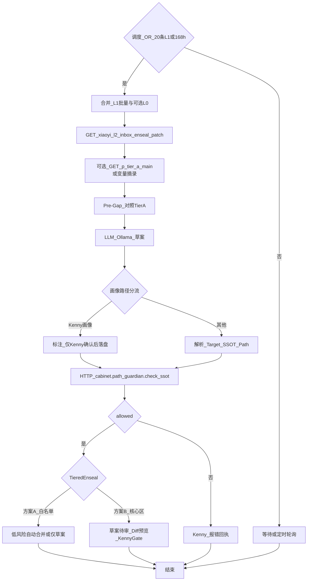

# WF_InboxRefine_Patch（设计真源）

> **L2**：须遵守 [`Manuals/Dify_应用开发规范.md`](file:///Volumes/Cabinet/cabinet/obsidian_vault/000_Cabinet_System/Manuals/Dify_%E5%BA%94%E7%94%A8%E5%BC%80%E5%8F%91%E8%A7%84%E8%8C%83.md)。控制台配置与导出 JSON 为派生产物。  
> **主人画像分级**：[`Manuals/主人画像分级建立与使用规范.md`](file:///Volumes/Cabinet/cabinet/obsidian_vault/000_Cabinet_System/Manuals/%E4%B8%BB%E4%BA%BA%E7%94%BB%E5%83%8F%E5%88%86%E7%BA%A7%E5%BB%BA%E7%AB%8B%E4%B8%8E%E4%BD%BF%E7%94%A8%E8%A7%84%E8%8C%83.md) —— Pre-Gap 对照 **Tier A**（`Kenny_Cognitive_Profile.md`）；可选 HTTP `GET /prompts/p_tier_a_main` 与变量 `kenny_profile_excerpt` **二选一或叠加**（须控制总上下文）。  
> **Prompt 真源**：[`Agent/小忆/小忆_L2_inbox_enseal_patch.md`](file:///Volumes/Cabinet/cabinet/obsidian_vault/000_Cabinet_System/Agent/%E5%B0%8F%E5%BF%86/%E5%B0%8F%E5%BF%86_L2_inbox_enseal_patch.md)（HTTP：`xiaoyi_l2_inbox_enseal_patch`）。  
> **配对 ref_id**：与 L1 设计 [`WF_Inbox_L1_Summary.md`](file:///Volumes/Cabinet/cabinet/obsidian_vault/000_Cabinet_System/Dify/01_Ingest_%26_Memory/WF_Inbox_L1_Summary.md)、规划 [`AI-OB 主人认知炼化流水线整体规划.md`](file:///Volumes/Cabinet/cabinet/obsidian_vault/000_Cabinet_System/Infrastructure/AI-OB%20%E4%B8%BB%E4%BA%BA%E8%AE%A4%E7%9F%A5%E7%82%BC%E5%8C%96%E6%B5%81%E6%B0%B4%E7%BA%BF%E6%95%B4%E4%BD%93%E8%A7%84%E5%88%92.md) §3（v2.7）一致。

## L2 调度（OR）

满足 **任一** 即可进入本工作流（阈值建议 **Dify 环境变量** 可配）：

1. **条数**：`l1_batch_count >= 20`（来自 `summaries/` 或 manifest 等价条数）。
2. **时间闸**：当前时间 − **`last_l2_completed_at`** ≥ **168 小时**（滚动 7×24h，非日历周）。**`last_l2_completed_at`** 须持久化（RUNTIME 状态文件、SSOT 小表或 Dify 长期变量，由 Runbook 选定）。

**共振分析**：在已触发批次内，用 **「跨越 50 轮以上的逻辑共振」** 等规则做 **质量与叙事**（规划 §3），**不**替代上述 OR。

## 输入

- **`l1_summaries_bulk`**：多条 L1 小结 Markdown 拼接或 JSON 列表（必填）。
- **`dialogue_excerpt`**（可选）：指向 L0 的引用片段，供核对。
- **`kenny_profile_excerpt`**（可选）：**Tier A** 摘录（与 `Kenny_Cognitive_Profile.md` 同源），供 **Pre-Gap**；若为空且需全文对照，可由上游节点拉取 HTTP **`p_tier_a_main`**（见画像规范 §6）。

## Pre-Gap（偏差预警 · Tier A）

- 生成 Patch 前须对照 **Tier A** 真源（`Kenny_Cognitive_Profile.md` 或上述注入/HTTP）：若新命题与「本地优先 / 数据主权」等既有公理 **冲突**，须在输出中用 **显著标记**（如「⚠️ Pre-Gap」小节）写出偏差；**不得**在本工作流内 **自动改写** 画像文件。

## 画像分流

- **`Target_SSOT_Path`** 若落在 **`Agent/小忆/Kenny画像/`**（含 `Kenny_Cognitive_Profile.md`）：输出须标明 **「画像分支 · 仅 Kenny 确认后可落盘」**，且默认走 **Kenny Gate**；与 **一般 SSOT Patch** 分支在 UI/文案上分岔。

## 分级封印 Tiered Enseal（Post-check_ssot）

在 `cabinet.path_guardian.check_ssot` **通过** 后，按落点路由：

| 分支 | 条件 | 行为 |
|------|------|------|
| **方案 A** | 目标为 RUNTIME / `200_Operations` 下 **非 SSOT 真值** 且路径在白名单 | 可自动合并草案 + **CHANGELOG** 审计行；静默提示「已自动同步 N 个低风险补丁」（实现见 TOOLS 迭代）。 |
| **方案 B** | 紫色 SSOT、`000_Cabinet_System/` **核心区**、画像、战略公理、Agent 角色定义等 | **强制**：仅输出草案 / `.patch` 入待审区；对话 **Diff 预览**；Kenny **交互确认** 或 Obsidian 检阅后 `enseal_skill` / `seal-batch`。 |

**红线**：`Target_SSOT_Path` 命中 **`000_Cabinet_System/` 核心区** → **仅方案 B**。

## Mermaid（逻辑）

## Skill Map（经 Mac 薄 API / skill_manager）

| 技能键 | 用途 |
|--------|------|
| `cabinet.path_guardian.check_ssot` | 校验 `Target_SSOT_Path` 相对路径 |
| （可选）`cabinet.dialog.inbox_list` | 列举待炼化会话 |

**铁律**：调用 `skill_manager` 时 `--agent xiaoyi`（或小酷，按 registry 授权）。

## 节点函数表

| 节点 ID | 函数 Key | 输入 | 说明 |
|---------|----------|------|------|
| CheckSSOT | `cabinet.path_guardian.check_ssot` | `path`, `as_dir` | 非法则走 ErrReply |
| LLM | — | `l1_summaries_bulk`, `dialogue_excerpt`, `system_prompt_from_ssot` | 模型连 `127.0.0.1:11434/v1`（3090 同机） |

### Knowledge 绑定（Dify 规范 §3.6）

| 节点 / 说明 | Dataset ID | OB 源路径 | 同步方式 |
|-------------|------------|-----------|----------|
| **N/A** | — | — | 默认 **不绑定** Knowledge。若启用 **Tier C** 辅助检索，须单独 Dataset + `_kb_sources` + `sync_to_dify.py`，见 [`Manuals/Dify_应用开发规范.md`](file:///Volumes/Cabinet/cabinet/obsidian_vault/000_Cabinet_System/Manuals/Dify_%E5%BA%94%E7%94%A8%E5%BC%80%E5%8F%91%E8%A7%84%E8%8C%83.md) §3.6。 |

## Prompt HTTP 响应契约（§7.2）

- `Content-Type`: `text/markdown; charset=utf-8` 或 `application/json`
- `Last-Modified` / `ETag: "md5-..."` 供缓存失效

## 网络（L0.6.2）

- Mac 浏览器 / API：`http://10.210.8.8:5001`
- Dify → Ollama：`http://127.0.0.1:11434/v1`
- Dify → Mac 技能网关：Mac 的 **ZeroTier IP** + 端口（与 `preflight_dify_zt.py` 预检一致）

## Error Handling（非法路径）

向 Kenny 输出固定话术模板：**「Target_SSOT_Path 未通过 path_guardian：{{violations}}；请修正后再 materialize。」**

## 导出

导入 Dify 验证后，将 DSL/JSON 放入 `Dify/_exports/` 并更新本 Frontmatter 的 `dify_artifact`、`dify_exported_at`。
