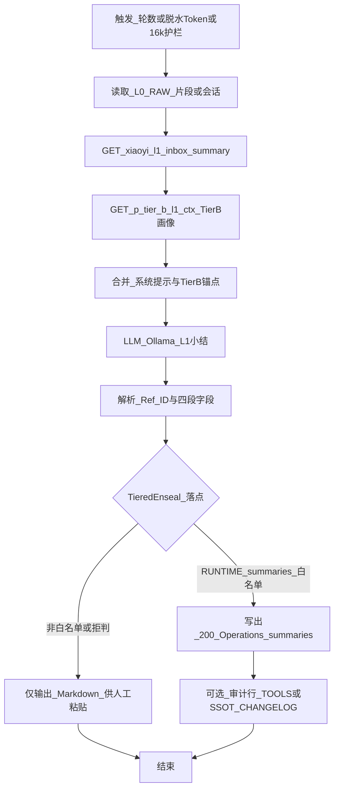

# WF_Inbox_L1_Summary（设计真源）

> **L1**：须遵守 [`Manuals/Dify_应用开发规范.md`](file:///Volumes/Cabinet/cabinet/obsidian_vault/000_Cabinet_System/Manuals/Dify_%E5%BA%94%E7%94%A8%E5%BC%80%E5%8F%91%E8%A7%84%E8%8C%83.md)。控制台配置与导出 JSON 为派生产物。  
> **主人画像分级**：[`Manuals/主人画像分级建立与使用规范.md`](file:///Volumes/Cabinet/cabinet/obsidian_vault/000_Cabinet_System/Manuals/%E4%B8%BB%E4%BA%BA%E7%94%BB%E5%83%8F%E5%88%86%E7%BA%A7%E5%BB%BA%E7%AB%8B%E4%B8%8E%E4%BD%BF%E7%94%A8%E8%A7%84%E8%8C%83.md) —— L1 **仅 Tier B**；HTTP `GET /prompts/p_tier_b_l1_ctx`（与 `xiaoyi_l1_inbox_summary` 可并行拉取后合并上下文）。  
> **Prompt 真源**：[`Agent/小忆/小忆_L1_inbox_summary.md`](file:///Volumes/Cabinet/cabinet/obsidian_vault/000_Cabinet_System/Agent/%E5%B0%8F%E5%BF%86/%E5%B0%8F%E5%BF%86_L1_inbox_summary.md)（HTTP：`GET /prompts/xiaoyi_l1_inbox_summary`）。  
> **规划真源**：[`Infrastructure/AI-OB 主人认知炼化流水线整体规划.md`](file:///Volumes/Cabinet/cabinet/obsidian_vault/000_Cabinet_System/Infrastructure/AI-OB%20%E4%B8%BB%E4%BA%BA%E8%AE%A4%E7%9F%A5%E7%82%BC%E5%8C%96%E6%B5%81%E6%B0%B4%E7%BA%BF%E6%95%B4%E4%BD%93%E8%A7%84%E5%88%92.md) §2（v2.7）。

## Mermaid（逻辑）

## 输入 / 输出变量（建议）

| 变量 | 说明 |
|------|------|
| `dialogue_excerpt` | L0 窗口正文（已脱敏策略按法典） |
| `round_count` | 当前窗口累计轮数（供触发判断） |
| `dehydrated_token_estimate` | 脱水后净区 token 估计（与 Runbook 口径一致） |
| `context_near_limit` | 布尔：逼近 16k 则优先切片小结 |
| `l1_summary_markdown` | LLM 输出，须含 `### [L1-Summary] Ref_ID:` 块 |

## 落盘约定

- **目录**：`obsidian_vault/200_Operations/summaries/`（即 RUNTIME 侧 `summaries/`，见 [`200_Operations/summaries/README.md`](file:///Volumes/Cabinet/cabinet/obsidian_vault/200_Operations/summaries/README.md)）。
- **文件名**：`L1_<UTC时间>_<session_slug>_<Ref_ID前8>.md`（或与 Dify 变量统一一种，Runbook 写死）。

## 触发节点（与规划 §2 一致）

- **OR**：满 **50 轮**；或脱水后净区 **≥30,000 token**。
- **护栏**：上下文 **~16k** → **强制切片小结**（优先生效）。

## Kenny Gate（RUNTIME 写入）

- 自动写入 `summaries/` 仅当路径落在 **显式白名单**（Tiered Enseal **方案 A**）；**紫色 SSOT / 画像** 相关落点 **禁止**在本工作流自动写入，须 **方案 B**（见 `WF_InboxRefine_Patch` 与 Runbook）。

## DSL 与 Mermaid 实现对照

| 层级 | 说明 |
|------|------|
| **设计真源** | 本节上文 Mermaid、输入输出表、触发与 Kenny Gate |
| **Prompt 真源** | [`Agent/小忆/小忆_L1_inbox_summary.md`](file:///Volumes/Cabinet/cabinet/obsidian_vault/000_Cabinet_System/Agent/%E5%B0%8F%E5%BF%86/%E5%B0%8F%E5%BF%86_L1_inbox_summary.md)（内含 **Dify/DSL 配对**速查表） |
| **当前归档 DSL** | `wf_inbox_l1_summary_20260330.yml`：**Start → 知识库检索（Tier C `dataset-SLkcbzIPqlKfRjql3OH3JQKF`，query=`dialogue_excerpt`）→ LLM（Context=`result` + User 含 `{{#context#}}`）→ End**。System 内嵌 [`小忆_L1_inbox_summary.md`](file:///Volumes/Cabinet/cabinet/obsidian_vault/000_Cabinet_System/Agent/%E5%B0%8F%E5%BF%86/%E5%B0%8F%E5%BF%86_L1_inbox_summary.md)（已剔运维表） |
| **与 Mermaid 差距** | HTTP 双拉 L1 Prompt + `p_tier_b_l1_ctx`、解析 Ref_ID/四段、TieredEnseal 写 `summaries/`、Changelog **仍**未入 YAML；由 `gen_dify_inbox_workflows.py` 维护 |
| **L2 下游** | 炼化与 Patch 草案见 [`WF_InboxRefine_Patch.md`](file:///Volumes/Cabinet/cabinet/obsidian_vault/000_Cabinet_System/Dify/01_Ingest_%26_Memory/WF_InboxRefine_Patch.md) / [`小忆_L2_inbox_enseal_patch.md`](file:///Volumes/Cabinet/cabinet/obsidian_vault/000_Cabinet_System/Agent/%E5%B0%8F%E5%BF%86/%E5%B0%8F%E5%BF%86_L2_inbox_enseal_patch.md) |

## Skill Map（可选）

| 技能键 | 用途 |
|--------|------|
| `cabinet.path_guardian.check_ssot` | 若未来扩展写 SSOT 外路径前的校验（默认 L1 只写 RUNTIME） |

### Knowledge 绑定（Dify 规范 §3.6）

| 节点 / 说明 | Dataset ID | OB 源路径 | 同步方式 |
|-------------|------------|-----------|----------|
| **N/A** | — | — | 见下行；同步与禁令仍适用。 |
| **Tier C · Kenny 画像 RAG** | `dataset-SLkcbzIPqlKfRjql3OH3JQKF` | `000_Cabinet_System/Dify/_kb_sources/kenny_portrait_tier_c/` | **已编入** 归档 DSL（知识库节点 query=`dialogue_excerpt`）；内容维护：`sync_to_dify.py`、切片见 [`kenny_portrait_tier_c/README.md`](file:///Volumes/Cabinet/cabinet/obsidian_vault/000_Cabinet_System/Dify/_kb_sources/kenny_portrait_tier_c/README.md)。检索结果经 **Context** 注入 LLM（`{{#context#}}`），**不替换** Tier A / 系统指令。 |

## 网络（L0.6.2）

- Mac / 脚本调 Dify Service API：`DIFY_API_BASE` 默认 **`http://10.210.8.8:5001`**，接口路径为 **`/v1/...`**（勿与无端口示例混淆）
- Dify → Ollama：`http://127.0.0.1:11434/v1`
- Dify → Mac Prompt 桥：ZeroTier IP + `8765`（与 `preflight_dify_zt.py` 一致）；画像 Tier B：`GET /prompts/p_tier_b_l1_ctx`（Bearer 同 `CABINET_PROMPT_TOKEN`）

## 导出

导入 Dify 验证后，将 DSL/JSON 放入 `Dify/_exports/` 并更新本 Frontmatter 的 `dify_artifact`、`dify_exported_at`。
