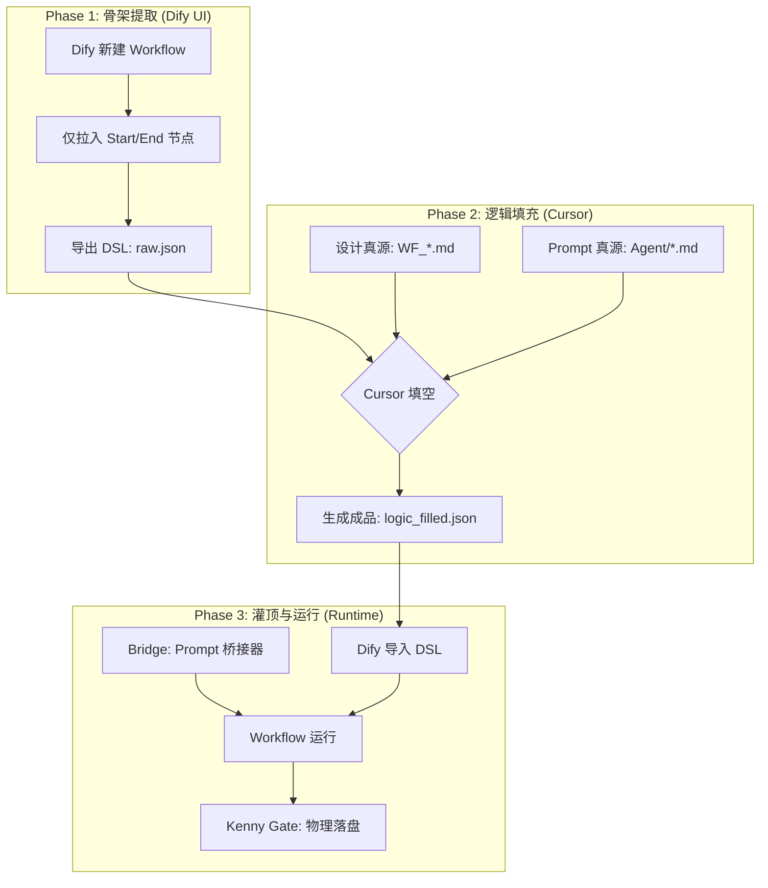

# Dify 应用设计文档根目录

本目录存放 **L2 生产级**（及自愿对齐的 L1）Dify 应用的设计文档（`.md`）与导出归档。

- **规范全文**：`000_Cabinet_System/Manuals/Dify_应用开发规范.md`（**V1.2**）
- **职能子目录**：
  - `01_Ingest_&_Memory` — 摄入与炼化
  - `02_Knowledge_&_Search` — 知识库与检索
  - `03_Creative_&_Production` — 创作与排版
  - `99_Infrastructure` — 审计与维护
- **导出归档**：`_exports/` — Dify 导出的 DSL / JSON 等 **工作流派生产物**，与设计文档 Frontmatter 中 `dify_artifact` 对应（**文档—产物双链**，见规范 §5）。
- **知识库源树**：`_kb_sources/` — 供 RAG 的受控 Markdown（或扩展类型）根目录；由 TOOLS `sync_to_dify.py` 推送至 Dify Dataset，**非** DSL 归档。可与 `_exports` 并存；本地 `.sync_cache.json` 为派生状态，建议不提交 Git（见规范 §6）。

命名约定见规范 **§1**、**§6**。

**本批 L2 示例**：[`01_Ingest_&_Memory/WF_InboxRefine_Patch.md`](01_Ingest_%26_Memory/WF_InboxRefine_Patch.md)（`ref_id: INFRA-DIFY-INBOX-20260329-01`）；导出见 [`_exports/README.md`](_exports/README.md)。

### 实施建议：Dify 应用半自动化落地 SOP (v1.0)

#### 1. 流程概览 (Mermaid)

代码段

#### 2. 标准步骤说明 (Markdown 格式)

##### **Step 1: 骨架提取 (Minimal Start)**

- **操作**：在 Dify 控制台新建一个空白 Workflow。
    
- **配置**：仅需在 `Start` 节点定义预期的输入变量（如 `dialogue_excerpt`）。
    
- **产出**：点击“导出 DSL”，将得到的 JSON 文件存入 `_exports/` 目录，命名为 `wf_xxx_raw.json`。
    

##### **Step 2: Cursor 逻辑灌顶 (Logic Infusion)**

- **环境**：在 Cursor 中同时打开三个文件：
    
    1. `_exports/wf_xxx_raw.json`（骨架）
        
    2. `WF_xxx_设计真源.md`（包含节点逻辑与 Mermaid 图）
        
    3. `Agent/xxx_Prompt.md`（提示词真源）
        
- **指令**：
    
    > "Cursor，请作为 Dify 架构专家，参考 `WF_设计真源.md` 的逻辑，将 `wf_xxx_raw.json` 升级为完整形态。请自动补全 HTTP 桥接节点（指向本地 8080 端口）、LLM 节点配置及变量映射。保持 `node_id` 风格一致。"
    
- **产出**：保存 Cursor 修正后的 `wf_xxx_filled.json`。
    

##### **Step 3: 物理同步与桥接 (Sync & Bridge)**

- **导入**：在 Dify UI 中点击“导入 DSL”，选择 `wf_xxx_filled.json` 覆盖当前应用。
    
- **启动桥接**：运行本地 `prompt_http_bridge.py`。
    
- **验证**：在 Dify 中点击预览运行，检查 LLM 是否成功通过 HTTP 拿到了 Obsidian 里的最新 Prompt。
    

##### **Step 4: 资产封印 (Enseal)**

- **归档**：将最终运行成功的 JSON 重命名为正式版本号（如 `v1.0.json`），并更新设计文档中的 `dify_artifact` 字段。