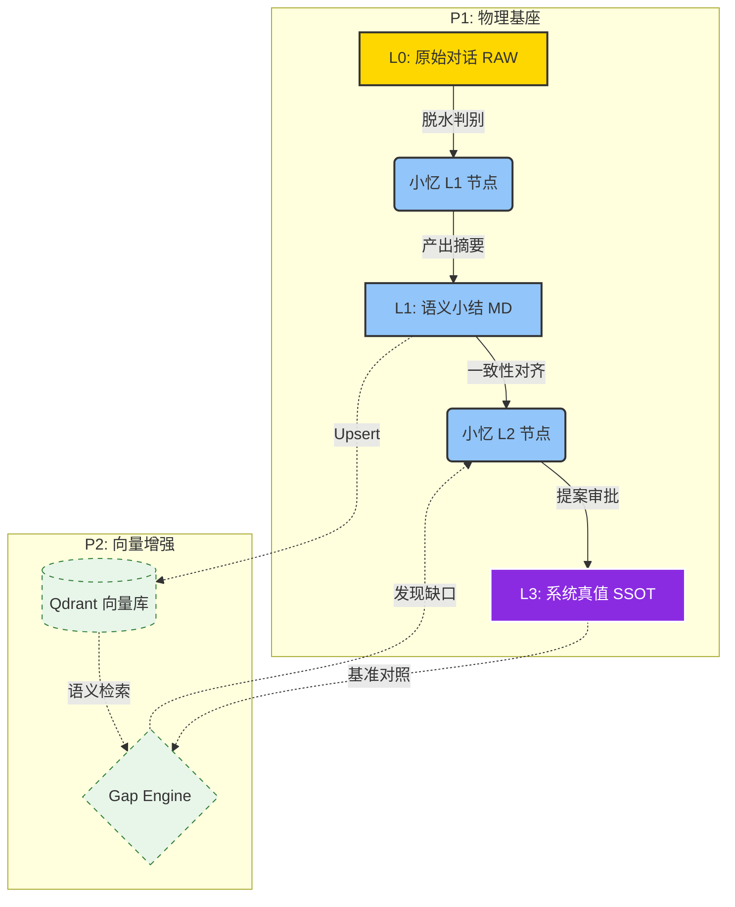

---


---

# 📥 AI-OB 认知炼化流水线整体规划 (v2.7 · 混合记忆预备版)

# 核心原则：L1 语义脱水 (清洗), L2 跨度炼化 (封印)；预留 Qdrant 接口，衔接补全引擎。

**v2.7 变更摘要**：与 [`Manuals/主人画像分级建立与使用规范.md`](../Manuals/%E4%B8%BB%E4%BA%BA%E7%94%BB%E5%83%8F%E5%88%86%E7%BA%A7%E5%BB%BA%E7%AB%8B%E4%B8%8E%E4%BD%BF%E7%94%A8%E8%A7%84%E8%8C%83.md)（v1.0）对齐——**画像 Tier A/B/C**、L1 仅轻量 **Tier B** 注入、L2 **Pre-Gap** 显式对照 **Tier A**；Prompt HTTP 桥 slug `p_tier_*` 与 `Kenny画像/` 受保护路径见该 Manual §6。

## 1. 📂 架构分层与混合存储 (Infrastructure)

|**层次**|**目录路径（真源）**|**存储介质 (P1 → P2)**|**职能描述**|
|---|---|---|---|
|**L0: RAW**|见下 **「路径真源对照表」**|物理 `.md`|**原始矿脉**。保留全量对话，作为 P2 Embedding 的原始溯源。|
|**L1: Summary**|`RUNTIME_ROOT/summaries/`（相对 RUNTIME，物理多为 `200_Operations/summaries/`）|物理 `.md` + **[Qdrant Payload]**|**脱水记忆**。经小忆清洗后的纯净意图流，P2 将作为向量库主要写入源。|
|**L2: SSOT**|`000_Cabinet_System/Agent/小忆/Kenny画像/` 等（Patch 目标路径经 `check_ssot`）|物理 `.md` (紫色资产)|**系统真值**。存放定稿公理，作为 P2 `Gap Engine` 的核心对照基准线。|

### 路径真源对照表（L0 勘误）

| 叙述 | 真源 | 说明 |
|------|------|------|
| **L0 法典落盘** | `RUNTIME_ROOT/ai_dialogue_inbox/*.md` + `inbox_manifest.jsonl` | 与 [`多源对话收件法典.md`](file:///Volumes/Cabinet/cabinet/obsidian_vault/000_Cabinet_System/Infrastructure/%E5%A4%9A%E6%BA%90%E5%AF%B9%E8%AF%9D%E6%94%B6%E4%BB%B6%E6%B3%95%E5%85%B8.md)、TOOLS `dialog_inbox.py` 一致；`RUNTIME_ROOT` 在 vault 侧通常对应 `obsidian_vault/200_Operations/`。 |
| **历史别名** | `100_Inbox_Intelligence/ai_dialogue_inbox/` | v2.5 及更早文档中的路径；**不再**作为唯一真源，仅作迁移/别名参照。 |

### 主人画像与分级（SSOT）

- **物理区**：`Agent/小忆/Kenny画像/` 存放主人画像类 Markdown（及侧车 YAML 等）；与 L1/L2 **逻辑编排**分离，由 **分级规范** 定义谁在读哪一层。
- **契约真源**：[`Manuals/主人画像分级建立与使用规范.md`](../Manuals/%E4%B8%BB%E4%BA%BA%E7%94%BB%E5%83%8F%E5%88%86%E7%BA%A7%E5%BB%BA%E7%AB%8B%E4%B8%8E%E4%BD%BF%E7%94%A8%E8%A7%84%E8%8C%83.md) —— 含 **Tier A/B/C**、**使用矩阵**、**`p_tier_*` HTTP slug**、Kenny画像 **HTTP 仅显式放行**。
- **引用层优先**：分级首先是 **注入方式与 Prompt 约束**；Dify Knowledge（Tier C）为可选，见 [Dify_应用开发规范](../Manuals/Dify_%E5%BA%94%E7%94%A8%E5%BC%80%E5%8F%91%E8%A7%84%E8%8C%83.md) §6。

---

## 2. 💧 L1 级：语义脱水小结 (WF_Inbox_L1_Summary)

**定位**：将“碎碎念”与“复制噪音”转化为“高信噪比语义块”。

- **画像注入（Tier B）**：L1 **仅**使用 **Tier B** 轻量上下文（指代锚定、项目偏好），实现上优先 **HTTP** `GET .../prompts/p_tier_b_l1_ctx`（见画像规范 §6）或等价 **短变量**；**禁止**默认挂载 **Tier A**（`Kenny_Cognitive_Profile.md`）全文，避免挤占脱水窗口或越权「公理裁决」。Tier B **不可替代** Tier A 做冲突终审。
- **弹性触发（OR）**：
    - **跨度**：满 **50 轮**原生对话（User/Assistant 计轮方式与运维/Dify 一致）。
    - **脱水后体量**：待小结窗口内先做 **噪音折叠**（复制素材仅保留 Ref_Index/Metadata，不计入净区）后，**可摘要净内容**累计达 **30,000 token**（计数口径与 Ollama tokenizer 或统一 tiktoken 策略一致，Runbook 写死）。
- **安全护栏**：显存/上下文监控，达到模型上下文阈值（如 **16k**）**强制切片小结**（优先于凑满 30k，防爆窗）。

- **脱水逻辑 (P2 兼容性优化)**：
    - **原生识别**：优先捕捉人称代词（我/你）及意图词，赋予高权重。
    - **噪音折叠**：对复制素材执行“索引化”，仅保留 Metadata（标题/URL），不入摘要正文净区。

### 四段框架 ↔ v2.6 机读字段映射

| 四段（人读提纲） | 机读字段 | 说明 |
|------------------|----------|------|
| Context 锚点 | `Metadata` + `Intent` 首句 | 时空、项目、会话锚 |
| 统帅核心意图 | `Intent` | 核心任务意图 |
| 认知增量线索 | `Native_Soul` | 原生认知点（权重示例 1.0） |
| 噪音标记 | `Ref_Index` + `Metadata` 外链 | 素材索引（权重示例 0.1） |

- **输出格式 (预留 P2 埋点)**：
    
    Markdown
    
    ```
    ### [L1-Summary] Ref_ID: {{UUID}}
    - **Intent**: 核心任务意图
    - **Native_Soul**: 原生认知点 (权重: 1.0)
    - **Ref_Index**: [素材索引] (权重: 0.1)
    - **Metadata**: { "tags": [], "project": "", "timestamp": "" } # 预留给 Qdrant Payload
    ```
    

---

## 3. ⚙️ L2 级：认知总炼化 (WF_InboxRefine_Patch)

**定位**：跨时间维度对齐画像，识别认知进化轨迹。

- **调度触发（OR）**：
    - **条数**：累计 **≥20 条** L1 小结（或 manifest 等价条数）。
    - **时间闸**：**自然滚动 168 小时**——自 **上次 L2 总炼化成功完成** 时刻起算，满 **7×24h** 即满足时间分支（非日历周、非周一零点）。
- **一致性 / 质量分析（触发后）**：在已满足上述 OR 而选定的批次内，寻找 **跨越 50 轮以上的“逻辑共振”** 等模式，用于 Patch 质量与叙事，**不**单独作为与条数并列的硬门槛。

- **补全预览 (Pre-Gap Engine)**（**Tier A** 对照）：
    - 小忆在生成 Patch 时，须对照 **Tier A** 真源 [`Kenny_Cognitive_Profile.md`](../Agent/%E5%B0%8F%E5%BF%86/Kenny%E7%94%BB%E5%83%8F/Kenny_Cognitive_Profile.md)（或工作流注入的 `kenny_profile_excerpt` / HTTP `p_tier_a_main`），判断新命题是否与既有公理冲突。详见 [主人画像分级建立与使用规范](../Manuals/%E4%B8%BB%E4%BA%BA%E7%94%BB%E5%83%8F%E5%88%86%E7%BA%A7%E5%BB%BA%E7%AB%8B%E4%B8%8E%E4%BD%BF%E7%94%A8%E8%A7%84%E8%8C%83.md) **§5 使用矩阵**。
    - **偏差预警**：若当前方案违背“本地优先/数据主权”，必须显著标红。

- **画像分流**：Patch / 一般 SSOT 更新与 **`Kenny画像/`**（含 `Kenny_Cognitive_Profile.md`）**分岔**；画像内容 **仅**在 Kenny 确认后由人工或受控流程写入。

- **封印动作**：产出 `Cognitive_Patch_Draft.md` 或等价草案，经 Kenny 确认后更新 SSOT。

### 分级封印 Tiered Enseal（方案 A + B）

| 方案 | 适用 | 执行要点 |
|------|------|----------|
| **A · 低风险自动合并** | RUNTIME 配置、`200_Operations` 下非 SSOT 真值文档、临时看板等 | 路径经 **显式白名单** 校验后可自动落盘；**CHANGELOG** 留审计行；交互上可静默提示（如「已自动同步 N 个低风险补丁」）。**工程实现**见 TOOLS 迭代，须与 `path_guardian` / PSR 一致。 |
| **B · 高主权人工封印** | 紫色 SSOT、`Kenny画像/`、战略公理、Agent 角色定义、OpenBT 核心安全等 | 产出 `.patch` / 草案入待审区（如 `000_Cabinet_System/Drafts/` 或 RUNTIME drafts，**须**在白名单注册）；对话 **Diff 预览**；Kenny Gate：**交互确认**或 Obsidian 检阅后 `seal` / `enseal_skill`。 |
| **红线** | `Target_SSOT_Path` 解析后命中 **`000_Cabinet_System/` 核心区**（紫色资产、画像、战略公理等） | **强制方案 B**，禁止自动合并。 |

---

## 4. 🧠 未来衔接：P2 认知增强 (Cognitive Augmentation)

本规划已通过以下设计预留了对 **附件 2-3** 的支持：

- **Qdrant 接入点**：L1 小结的 `Metadata` 字段可直接映射为 Qdrant 的 Payload 结构。
- **Gap Engine 挂载**：L2 炼化过程已被定义为“结构师”模式，未来只需将“对比逻辑”替换为向量检索对比即可。
- **画像进化**：画像不再是静态文档，而是“MD 公理 + 向量潜台词”的混合体。**Tier C** 切片与 Gap 对照的边界见 [主人画像分级建立与使用规范](../Manuals/%E4%B8%BB%E4%BA%BA%E7%94%BB%E5%83%8F%E5%88%86%E7%BA%A7%E5%BB%BA%E7%AB%8B%E4%B8%8E%E4%BD%BF%E7%94%A8%E8%A7%84%E8%8C%83.md) §3 / §7。

---

## 🛡️ 运行红线 (Safety & Red Lines)

- ❌ **严禁跳级**：任何认知更新必须经过 L1 脱水，禁止将含噪音的 RAW 直接炼化为画像。
- ❌ **L1 不得越级裁决**：L1 不得使用 **Tier A** 作「最终公理判决」或编造未在输入中出现的公理级承诺；公理冲突识别与 Pre-Gap **归属 L2**（见画像规范）。
- ❌ **隐私硬隔离**：在未引入 P2 向量加密方案前，所有画像炼化必须在 3090 本地完成。
- ✅ **路径守卫**：所有 Patch 路径必须通过 `check_ssot` 校验，确保资产主权。

---

### 🎨 两段式认知进化流 (P2 融合版 Mermaid)

代码段



---

