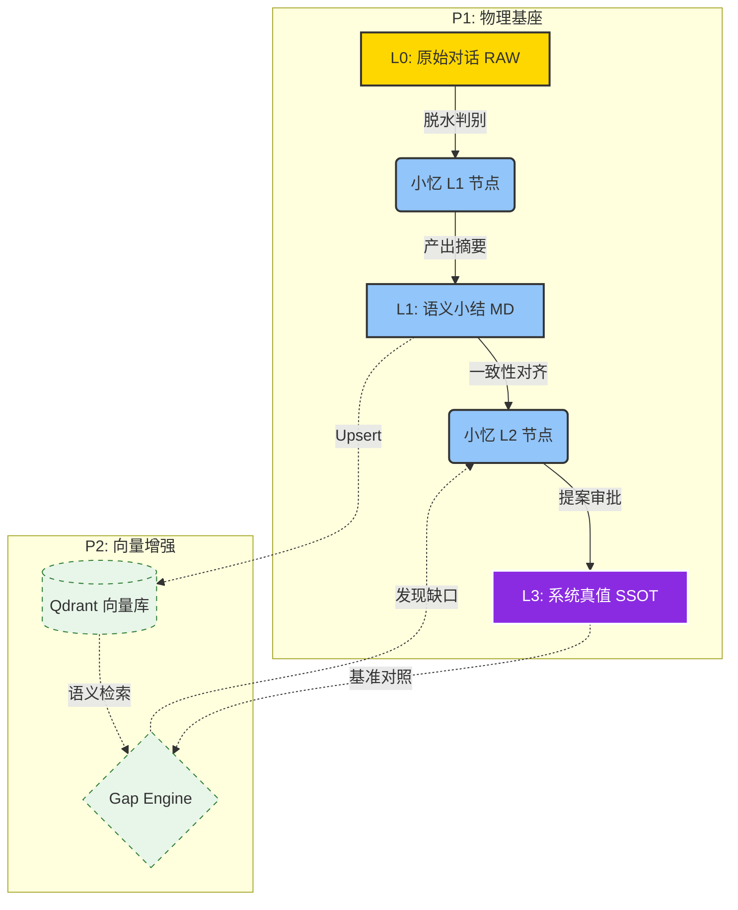

---


---

# 📥 AI-OB 认知炼化流水线整体规划 (v2.5 · 混合记忆预备版)

# 核心原则：L1 语义脱水 (清洗), L2 跨度炼化 (封印)；预留 Qdrant 接口，衔接补全引擎。

## 1. 📂 架构分层与混合存储 (Infrastructure)

|**层次**|**目录路径（CABINET_ROOT 下）**|**存储介质 (P1 → P2)**|**职能描述**|
|---|---|---|---|
|**L0: RAW**|`100_Inbox_Intelligence/ai_dialogue_inbox/`|物理 `.md`|**原始矿脉**。保留全量对话，作为 P2 Embedding 的原始溯源。|
|**L1: Summary**|`200_Operations/summaries/`|物理 `.md` + **[Qdrant Payload]**|**脱水记忆**。经小忆清洗后的纯净意图流，P2 将作为向量库主要写入源。|
|**L2: SSOT**|`000_Cabinet_System/Agent/小忆/Kenny画像/`|物理 `.md` (紫色资产)|**系统真值**。存放定稿公理，作为 P2 `Gap Engine` 的核心对照基准线。|

---

## 2. 💧 L1 级：语义脱水小结 (WF_Inbox_L1_Summary)

**定位**：将“碎碎念”与“复制噪音”转化为“高信噪比语义块”。

- **弹性触发**：
    
    - **跨度**：15-30 轮原生对话，或原生 Token 达 3000-5000。
        
    - **安全护栏**：显存占用监控，达到模型上下文阈值（如 16k）强制切片小结。
        
- **脱水逻辑 (P2 兼容性优化)**：
    
    - **原生识别**：优先捕捉人称代词（我/你）及意图词，赋予高权重。
        
    - **噪音折叠**：对复制素材执行“索引化”，仅保留 Metadata（标题/URL），不入摘要。
        
- **输出格式 (预留 P2 埋点)**：
    
    Markdown
    
    ```
    ### [L1-Summary] Ref_ID: {{UUID}}
    - **Intent**: 核心任务意图
    - **Native_Soul**: 原生认知点 (权重: 1.0)
    - **Ref_Index**: [素材索引] (权重: 0.1)
    - **Metadata**: { "tags": [], "project": "", "timestamp": "" } # 预留给 Qdrant Payload
    ```
    

---

## 3. ⚙️ L2 级：认知总炼化 (WF_InboxRefine_Patch)

**定位**：跨时间维度对齐画像，识别认知进化轨迹。

- **一致性校验**：检索 10 条以上 L1 小结，寻找跨越 50 轮以上的“逻辑共振”。
    
- **补全预览 (Pre-Gap Engine)**：
    
    - 小忆在生成 Patch 时，需初步判断新逻辑是否与 `Kenny_Cognitive_Profile.md` 中的既有公理冲突。
        
    - **偏差预警**：若当前方案违背“本地优先/数据主权”，必须显著标红。
        
- **封印动作**：产出 `Cognitive_Patch_Draft.md`，经 Kenny 确认后更新 SSOT。
    

---

## 4. 🧠 未来衔接：P2 认知增强 (Cognitive Augmentation)

本规划已通过以下设计预留了对 **附件 2-3** 的支持：

- **Qdrant 接入点**：L1 小结的 `Metadata` 字段可直接映射为 Qdrant 的 Payload 结构。
    
- **Gap Engine 挂载**：L2 炼化过程已被定义为“结构师”模式，未来只需将“对比逻辑”替换为向量检索对比即可。
    
- **画像进化**：画像不再是静态文档，而是“MD 公理 + 向量潜台词”的混合体。
    

---

## 🛡️ 运行红线 (Safety & Red Lines)

- ❌ **严禁跳级**：任何认知更新必须经过 L1 脱水，禁止将含噪音的 RAW 直接炼化为画像。
    
- ❌ **隐私硬隔离**：在未引入 P2 向量加密方案前，所有画像炼化必须在 3090 本地完成。
    
- ✅ **路径守卫**：所有 Patch 路径必须通过 `check_ssot` 校验，确保资产主权。
    

---

### 🎨 两段式认知进化流 (P2 融合版 Mermaid)

代码段



---

