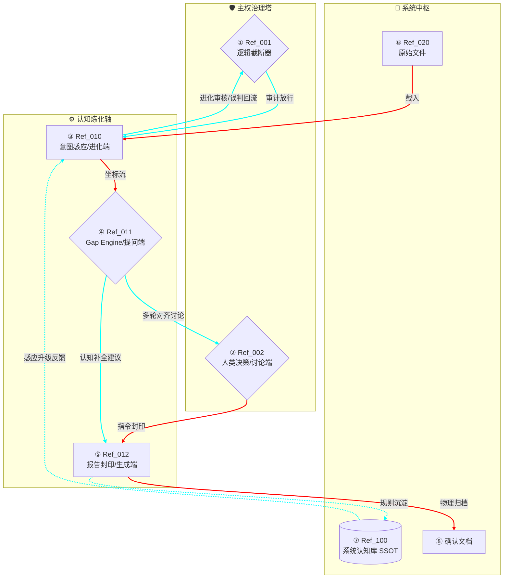

---

# 🛡️ AI-OB 协议：人机映射 (Human-Machine Mapping) v2.2

**版本**：v2.2 (Final / 系统级进化版)

**密级**：L1 核心资产 (SSOT)

**状态**：已封印，进入全量生产阶段

**物理锚点**：`[[AI-OB 协议：人机映射.canvas]]`

---

## 1. 协议定义 (Definition)

**人机映射**是连接统帅**非线性直觉**与机器**确定性逻辑**的底层通信协议。它通过将 Canvas 的空间拓扑（位置、距离、留白）解构并重组为 Mermaid 结构化代码，实现认知资产的“炼化”与“封印”。将文档, 机器结构(mermaid) 与 canvas (人类干预结构) 对齐后形成资产存档. 

- **双轨核心**：Canvas 负责捕捉“为什么 (Why)”，Mermaid 负责落实“怎么做 (How)”。

- **人机映射 (HMM)**：连接统帅**非线性直觉**（Canvas 空间拓扑）与机器**确定性逻辑**（Mermaid/MD）的底层通信协议。
    
- **红青双轨机制 (Bi-Track)**：
    
    - **🔴 红色路径 (文件物理流)**：处理具体的资产加工、坐标解析与文件归档。
        
    - **🔵 青色路径 (认知进化流)**：处理意图感应、缺口讨论、规则补全与系统级自学习。
        
- **愿景**：实现“意图即路径，对话即进化”。
-
## 2. 协议意义 (Significance)

- **保真度隔离**：防止机器逻辑在转译过程中过滤掉统帅思考时的权衡与灵感火花。
    
- **认知补全 (Gap) 原型**：即便在自动化工具缺失阶段，亦能通过空间留白视觉化地呈现逻辑漏洞。
    
- **主权确权**：通过“主权治理塔”分区，确保 AI 永远处于“被审计”与“被决策”的下位。
-
- 系统核心组件 (Core Components)

|**编号**|**组件名称**|**职能描述**|
|---|---|---|
|**n1**|**🛡️ 逻辑截断器**|**宪法审计**：识别认知补全带来的[误判信号]，执行强制熔断。|
|**n2**|**👤 人类决策 (讨论端)**|**认知裁决**：作为系统的最高主权，通过与 n4 的对话完成逻辑封印。|
|**n3**|**🔍 意图感应 (进化端)**|**坐标解析**：实时加载来自 n7 的规则，将统帅的空间布局转化为逻辑。|
|**n4**|**⚙️ Gap Engine (提问端)**|**缺口探测**：扫描逻辑断裂点，主动发起[多轮交互讨论]。|
|**n5**|**🤖 报告封印 (生成端)**|**双态产出**：同时封印物理文档报告与[认知补全报告]。|
|**n7**|**📚 系统认知库 (Brain)**|**认知底座**：存放审核通过的全局规则，驱动系统级进化。|

---

## 3. 使用范围 (Scope)

- **高阶架构设计**：如《慰康》养老项目、Gap 引擎本身的迭代设计。
    
- **多维决策分析**：涉及技术、商业、主权边界等多因素博弈的场景。
    
- **SSOT 资产封印**：所有需要存入核心真值库（Vault Native）的长期结构化知识。
    

---
## 4. 🧬 交互与流转规则 (Operational Rules)

### 4.1 对话式对齐 (Dialogic Alignment)

当系统处于不确定状态或发现逻辑缺口时，必须遵循**“如同你我现在一样的讨论”**原则：

1. **主动呈递**：n4 发现孤立节点或规则冲突，向 n2 提交上下文。
    
2. **多轮交互**：n2 通过自然语言纠偏或物理调整 Canvas。
    
3. **共识转化**：讨论结果直接转化为 `037_认知补全` 建议，流向 n5。
    

### 4.2 补全机制缺失下的处理 (Fallback Protocol)

在自动化 Gap Engine 尚未完全介入或规则库为空时：

- **视觉巡检**：统帅在 Canvas 中观察物理留白，通过手动拉线或标记颜色触发人工补全。
    
- **强制挂起**：若感应器（n3）无法识别意图，系统禁止生成伪逻辑，必须退回 n2 申请人工逻辑注入。
    

### 4.3 系统级进化闭环

- **局部到全局**：n5 生成的“认知补全报告”在经过 n2 审核后，沉淀至 n7。
    
- **动态感应**：n7 的新规则实时反哺 n3。后续文档的映射将自动继承此认知，无需重复讨论。
    

---

## 5. 🛡️ 主权治理与安全 (Governance & Safety)

### 5.1 误判拦截 (Safety Breach)

针对“认知进化”可能产生的副作用（如规则冲突导致的新误判）：

- **回流路径 (n3 → n1)**：感应器在执行新规则时若发现逻辑打结，必须通过青色流触发 n1 熔断。
    
- **重审放行**：熔断后，系统重置为安全模式，等待统帅重新配置宪法原则。
    

### 5.2 空间分区主权

- **左区 (x < -500)**：治理塔（n1, n2）。非统帅指令，AI 严禁在此区生成节点。
    
- **中区 (-500 < x < 500)**：炼化轴。AI 根据感应规则进行逻辑生成。## 4. 🧬 资产炼化阶段 (The Refinery Workflow v2.0)

本工作流支持 [自动化转译] 与 [人工视觉自检] 双模式：

1. **意图起笔 (Intent/Canvas)**：统帅在 Canvas 上通过分区（左/中/右）建立初步蓝图。
    
2. **主权审计 (Governance)**：检查节点是否违反“本地优先”或“数据脱敏”原则。
    
3. **缺口感应 (Gap Sensing)**：
    
    - **[现阶段模式]**：统帅观察 Canvas 中的孤立节点或断线，视觉化确认逻辑缺口。
        
    - **[未来模式]**：Gap Engine 自动对比 Persona 规则库，高亮逻辑漏洞。
        
4. **施工转译 (Mapping/Mermaid)**：Skill 解析坐标，生成符合“竖排重力”规范的 Mermaid 代码。
    
5. **结构封印 (Sealing)**：封装 MD 资产，由统帅完成最后的 Option 点选。
    
6. **真值回流 (Truth Backfill)**：封印后的决策反馈至 Canvas，将对应节点标记为“已封印”颜色。
7. **编号锚定 (ID Tagging)**：节点标题强制置顶编号，如 `(#Ref_001)`。    

---

## 6. 📜 机器逻辑视图 (Mermaid v2.0 Standard)

代码段

    
    
---
    
![[obsidian_vault/000_Cabinet_System/Manuals/人机映射.canvas]]

## 7. 🎨 战略蓝图规范 (Canvas v2.2 Standard)

**出图规则与空间映射逻辑：**

**编号显示与分区规则：**

- **节点标题规范**：
    
    - 格式：`(#Ref_编号) 节点名称`
        
    - 示例：`(#Ref_020) 养老系统架构`
        
    - **视觉要求**：在 Canvas 中，带编号的核心节点建议背景设为紫色或加粗，以示其为“已编号资产”。
    - 
- **物理分区映射**：
    
    - **$x < -500$ (左区)**：主权墙。放置宪法原则、安全规则与决策按钮。
        
    - **$-500 < x < 500$ (中区)**：炼化轴。放置核心逻辑节点，纵向排列。
        
    - **$x > 500$ (右区)**：参考池。放置外部引用、RAG 检索结果。
        
- **Gap 视觉定义**：
    
    - **孤立节点**：未连接任何线条，代表“待求证的想法”。
        
    - **红色节点/虚线框**：在转译中对应为 `%% TODO: Logic Gap`。
        
- **映射深度**：
    
    - 距离中心轴越近，在 Mermaid 中的层级越高；节点间的物理距离直接映射为逻辑的因果强度。
        

---

## 8. 工程保障条款 (Engineering Terms)

- **数据纯度**：生成的 Mermaid 代码块必须通过 CSS 隔离（classDef），确保在移动端及 Obsidian 各类主题下的渲染一致性。
    
- **映射一致性**：若 Canvas 蓝图发生重大布局变更，必须重新触发映射 Skill，以更新 MD 资产中的逻辑索引。
    
- **L0·1 强制审计**：任何自动化转译脚本严禁绕过统帅定义的“治理闸门”。
    

    
