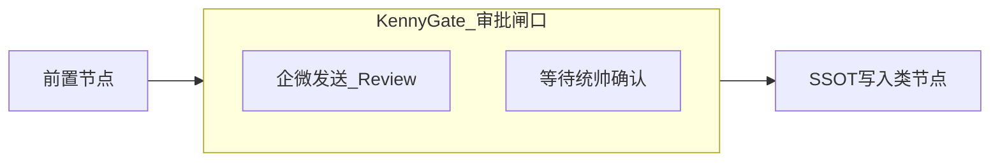

# Dify 应用开发规范 (V1.1)

> **SSOT 声明**：本规范定义内阁在 Dify 平台构建应用（Chatbot / Workflow）的标准。路径均相对于 **Obsidian 库根**。
>
> **契约真源**：L2 以 **本目录下的设计文档（`.md`）+ `agent_l1_registry.json` + `Internal_Cabinet_Tools` 代码** 为契约真源；Dify 控制台中的配置与 **导出 JSON** 为 **派生产物**，须与文档最终一致，但不可单独取代文档与 Registry。
>
> 所有 **L2 生产级** 线上应用必须在 `000_Cabinet_System/Dify/` 下拥有对应的 `.md` 设计文档，并按职能域归档。

---

## 0. 双轨制分级 (L1 / L2)

为兼顾开发效率与内阁数据安全，所有 Dify 应用划分为两个管理等级。

### L1 实验级 (Draft / Sandbox)

- **定义**：仅涉及数据读取、对话实验、外网调研，**不涉及**任何 `cabinet.*` 写入、修改或 SSOT 变更的应用。
- **文档要求**：**非强制**。允许在 Dify 侧直接验证意图。
- **标识**：建议应用名后缀加 `(Draft)`。

### L2 生产级 (Active / Production)

- **定义**：涉及 **物理封印 (Enseal)**、**多源收件 (Ingest)**、**SSOT 路径修改** 等核心代谢业务的应用。
- **文档要求**：**强制执行本规范**；必须在 `000_Cabinet_System/Dify/` 下维护对应 `.md`。
- **核心约束**：Mermaid 逻辑图（含 Kenny Gate 子图）、身份注入校验、审批闸口、函数解剖表。

### 文档与导出 JSON 的「双链」说明

「双轨制」在本文中专指 **L1 / L2**。另有一套常用说法：**设计文档（`.md`）** 与 **Dify 导出 JSON** 的配对与归档，见 **§5**，勿与 L1/L2 混称；必要时可称 **文档—产物双链**。

---

## 1. 物理目录与文件命名

所有 **L2** 设计文档按职能域归类，路径模式：

`000_Cabinet_System/Dify/{Domain_ID}_{Domain_Name}/{Slug_AppName}.md`

**职能域（四域，固定）**：

| 域目录 | 职责 |
|--------|------|
| `01_Ingest_&_Memory` | 数据摄入、清洗、炼化（如 inbox-enseal） |
| `02_Knowledge_&_Search` | 知识库检索、调研、RAG 增强 |
| `03_Creative_&_Production` | 内容创作、多媒体生成、格式排版 |
| `99_Infrastructure` | 系统审计、健康检查、日志同步 |

**导出归档**（可选但推荐）：`000_Cabinet_System/Dify/_exports/`，与 Frontmatter 字段 `dify_artifact` 对应（见 §5.1）。

---

## 2. 应用类型与交互契约

### 2.1 Chatbot（对话型）

- **核心职能**：意图路由、多轮访谈、轻量级指令触发。
- **Prompt 引用**：须显式标注真库 L1 Prompt（如 `Agent/小忆/小忆.md`），使 Dify 人格与真库一致。
- **工具限制**：仅挂载 `agent_l1_registry.json` 中该 `agent_slug` 已授权的 `cabinet.*` 技能。

### 2.2 Workflow（工作流型）

- **核心职能**：长链路自动化、定时任务、高可靠执行。
- **逻辑表达**：须包含 **Mermaid 流程图**，并标注节点间变量流转。

---

## 3. 核心准则与运行规范

### 3.1 身份注入（铁律）

所有调用 `skill_manager.py` 的节点必须携带：`--agent {{agent_slug}}`（使用实际 slug，非字面量）。

> **物理拦截**：严禁在 Dify 中硬编码权限替代 Registry；未授权时物理层须拒绝执行。

### 3.2 审批闸口 (The Kenny Gate)

- 凡涉及 **SSOT 写入、修改、删除** 的操作，须设 **人工审批** 节点。
- 审批节点须通过企微发送 `#Review` 提醒，**统帅确认后**方可继续。

**Mermaid 表达（主题无关，避免依赖填色）**：使用独立 `subgraph` 或 `KG_` 前缀节点表示闸口，便于浅色/深色主题下均可读。

### 3.3 变量与路径

- 透传 `conversation_id`（溯源）与 `ref_id`（审计）。
- 文件路径须经 `path_guardian` 预检；**禁止**在文档或工作流中暴露 3090 等内网机器的绝对路径。

### 3.4 运行与回执

- **路径安全**：同上，`path_guardian` 预检。
- **回执审计**：L2 流程结束须生成 `Ref_ID` 并通过企微回执（与现有内阁流程对齐）。

### 3.5 L2 必备四要素（Checklist）

L2 设计文档**缺一不可**，否则视为 **不合规部署**：

1. **身份溯源**：`agent_slug` + 真库 L1/L2 Prompt 路径引用。
2. **Mermaid 逻辑图**：含 **Kenny Gate** 子图或等价命名（见上）。
3. **函数解剖表**：全部 `cabinet.*` 调用、输入参数与预期输出。
4. **身份切换点**：若存在小忆（编排）↔ 小酷（执行）切换，须在图与契约中显式标注。

---

## 4. 与内阁脚本 / API 集成

与 `Internal_Cabinet_Tools/dify_client.py` 及 `.cursorrules` **L0.6.2** 对齐：

| 项目 | 说明 |
|------|------|
| 服务 | `DIFY_SERVICE`：`10.210.8.8:5001`（自托管默认；与内阁算力节点定义一致） |
| Base URL | 环境变量 `DIFY_API_BASE`，默认 `http://10.210.8.8:5001` |
| 鉴权 | 环境变量 `DIFY_API_KEY`：在 Dify 控制台为 **工作流应用** 创建的 App API Key |
| 调用路径 | `POST /v1/workflows/run`，`Authorization: Bearer <key>`，`Content-Type: application/json` |
| 请求体 | `inputs`、`response_mode`（常用 `blocking`）、`user` 等（详见官方文档） |
| 超时 | 长链路建议显式超时（参考代码默认 180s 量级，可按应用调整） |
| 依赖 | 脚本侧调用需 `httpx`（见 `dify_client.py`） |

**官方文档**：<https://docs.dify.ai/guides/application-publishing/developing-with-apis>

**密钥**：`DIFY_API_KEY` **禁止**写入设计文档、导出 JSON 或 Git；仅环境变量或密钥管理工具。

**n8n 与 P0**：内阁 P0 闭环 **不强制** 经过 n8n；Dify Workflow API、脚本与 `skill_manager` 可先行闭环。**不得以「必须接入 n8n」作为 P0 验收前提**（详见 `.cursorrules`）。

---

## 5. DSL / 导出 JSON 与人机分工

### 5.1 关联元数据（Frontmatter，推荐字段）

每份 `000_Cabinet_System/Dify/.../*.md` 建议在 YAML Frontmatter 中增加（名称可微调，语义建议保留）：

| 字段 | 含义 |
|------|------|
| `cabinet_dify_slug` | 内阁侧稳定标识，与文件名或应用逻辑名一致 |
| `dify_app_id` | Dify 应用 ID（导出 JSON 内通常可查，便于对账） |
| `dify_artifact` | 相对库根路径，指向**最近一次归档**的导出文件（如 `000_Cabinet_System/Dify/_exports/myapp_2026-03-28.json`） |
| `dify_exported_at` | ISO 8601 时间戳 |
| `dify_version_note` | 自托管版本号或 `Cloud` 等备注，便于兼容排查 |

**JSON 侧**：Dify 导出结构**不一定**保留自定义扩展字段。可靠做法是：约定 **`_exports/` 下文件名** 或同目录 **README / sidecar** 写明对应 `.md` 路径与 `cabinet_dify_slug`，勿假设修改 JSON 内部即可被平台回传。

### 5.2 人机分工

- **小酷（生成）**：依据本文档的 Mermaid、Skill Map 与节点表，生成 **可导入** 的工作流 / 应用 JSON **初稿**。
- **你（落地）**：API Key、Base URL、知识库 Dataset 绑定 ID、环境相关节点、用户可见话术等 **须在安全环境下** 自行配置或补全。

每次大改后：**重新导出** → 放入 `_exports/` → 更新 `dify_artifact` 与 `dify_exported_at`。

### 5.3 同步策略（现实边界）

- **Dify 控制台内修改 ≠ 自动回写 Obsidian**。若无定时任务、管理 API 或 n8n 等自动化，**不存在**开箱即用的「双向自动同步」。
- **推荐默认模型**：
  - **SSOT**：L2 以 **设计文档 + Registry + 代码** 为准；JSON 为派生物。
  - **主方向**：契约/文档更新 → 重生成或重导出 JSON → 再导入 Dify（人工或半自动即可）。
  - **反向（仅在 Dify 试改）**：再导出 → 更新 `dify_artifact` 与 `dify_exported_at`；L2 须保证与 `.md` 中 Mermaid / Skill 表 **最终一致**（草稿环境可暂不同步文档，上线前必须对齐）。
- **进阶（未来）**：定时调用 Dify 导出 API、diff 后写回 `_exports/` 等——**不在 V1.1 实现范围内**，仅预留流程与字段。

---

## 6. 知识库与同步（原则与占位）

- **数据源**：Obsidian 目录、受控导出物或后续专用管道；须标明是否与 SSOT 重叠、是否只读。
- **更新策略**：全量重建、按文件增量（如 mtime）、或业务事件触发（如封印完成后刷新索引）——具体方案按应用单独立项。
- **分级**：知识库须与 **L1/L2** 策略一致（实验库 vs 生产库、是否含敏感路径摘要）。
- **切片与元数据**：与内阁 YAML / 卡片等笔记规范 **对齐原则**，避免检索噪声与泄露。
- **验收**：自动化上线后应保留 **抽样问答与召回** 检查（脚本与频率另案，本规范不规定实现）。

---

## 7. 设计文档模板与新人 Checklist

### 7.1 必备章节顺序

1. **YAML Frontmatter**（含 §5.1 推荐字段，以及 `app_type`、`version`、`lead_agent` 等）。
2. **Mermaid Diagram**（含 `KennyGate` 子图或 `KG_` 节点）。
3. **Skill Map**：全部 `cabinet.*` 接口列表。
4. **节点函数表**（见下表模板）。
5. **节点 I/O**：机读输出结构，供后续节点引用（如 `{{Node_A.output.list[0].id}}`）。
6. **Error Handling**：API 失败、权限拒绝时的用户回执话术。

### 7.2 Agent 与 Prompt

- **主体**：标明 `agent_slug`。
- **禁止**在 Dify 内「盲写」与真库冲突的 System Prompt。
- **规范**：标注引用自 `Agent/{Agent_Name}/{Agent_Name}.md`；L2 专项可引用如 `小忆_L2_inbox_enseal_patch.md` 等。
- **校验**：Dify 侧 System Prompt 须为真库对应 MD 的 **全量镜像或经标注的逻辑子集**。

### 7.3 节点函数表模板

| 节点 ID | 函数 Key (Skill) | 输入定义 (Inputs) | 逻辑说明 |
|---------|------------------|-------------------|----------|
| `Node_A` | `cabinet.dialog.inbox_list` | `status="pending"` | 扫描待处理对话记录 |
| `Node_B` | `cabinet.enseal.seal_scan` | `target_path="{{path}}"` | 封印前 SSOT 路径扫描 |

（按实际节点增删。）

### 7.4 新人首条 L2 Workflow（极简步骤）

1. 在 `000_Cabinet_System/Dify/{域}/` 新建 `{Slug}.md`。
2. 填写 Frontmatter：`app_type: Workflow`、`lead_agent`、`cabinet_dify_slug` 等。
3. 写清 `agent_slug` 与 Prompt 真库路径。
4. 画 Mermaid，**包含 `KennyGate` 子图**。
5. 列出 Skill Map 与节点函数表、每节点 I/O。
6. 标注凡调用 `skill_manager` 处均带 `--agent`。
7. 标出所有路径经 `path_guardian`、变量含 `conversation_id` / `ref_id`。
8. 小酷生成 JSON 初稿；你配置密钥与知识库绑定（不写回文档）。
9. 导入 Dify 验证；导出到 `_exports/`，更新 `dify_artifact` 与 `dify_exported_at`。
10. 填写 Error Handling 与企微 `#Review` 话术；L2 自检 §3.5 四要素。

---

*规范版本 V1.1 · 与 `Internal_Cabinet_Tools/dify_client.py`、`.cursorrules` L0.6.2 对齐。*
