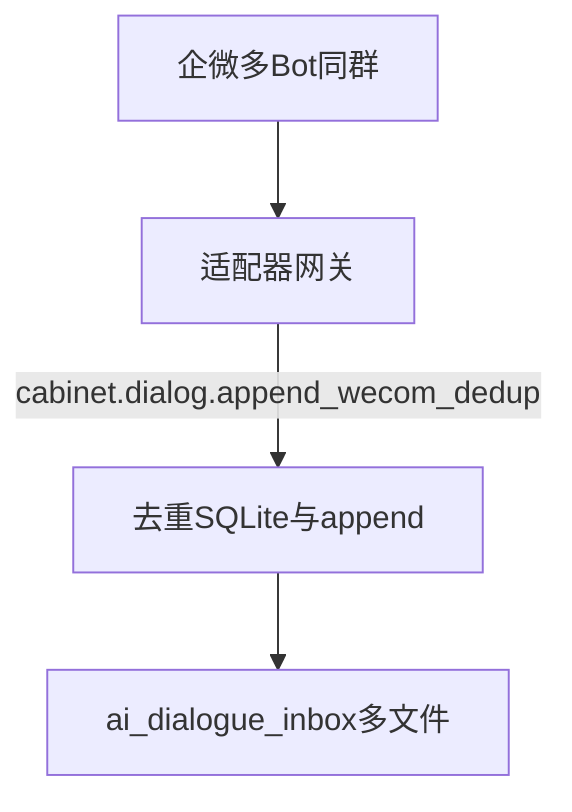
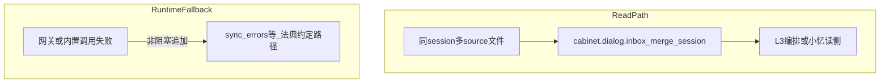

# 多 Agent 企微讨论 · 应用域 Skill

## 应用目标

多 Bot 企业微信群内讨论 → 对话统一落入 RUNTIME **`ai_dialogue_inbox`**；同群 **L3** 可合并时间线阅读；企微重试场景下 **去重防抖**；与 `(source, session_id)` 多文件模型一致，避免多 Bot 同文件并发改写。

## 场景 / 读者

- **内**：统帅、小酷（工具链）、适配器维护者、L3 编排（如小忆侧读合并）。  
- **可对外（原则）**：仅描述「多源收件 + 会话键 + 去重概念」，**不写**内网 IP、Token、具体 `roomid` / 私密群名。

**三位一体（摘要）**：**脑** = 本应用域意图叙事；**手套** = `dify_agent_tools_export.json` 中的 **`dify_suggested_name`**（外部编排识别 ID）；**手** = `cabinet.*`（`cabinet_builtins.dispatch_builtin`）。

**配套可视化**：同目录 **`多Agent企微讨论_应用域Skill.canvas`**（Obsidian Canvas，与本文 SSOT 成对维护；复杂数据流以本文 + 法典为准）。Mermaid 图见文末 **「图示（Mermaid）」**（在 P2 审计区之前，仍属规范 §5.3「线以上」正文）。

---

## 红线

- **不**替代 Kenny 审批与 **enseal** 流程。  
- **去重库**：须满足 **单机单写入** 或明确单点 ingress（见企微策略）；多机共 NFS 裸挂 SQLite 等场景须另设集中式方案。  
- **会话与源键**：与法典一致，`session_id` 与 `source` 组合唯一约束以 **现网 `dialog_inbox` 实现** 为准。

---

## 能力对照表（真源）

**JSON 真源**：`Internal_Cabinet_Tools/config/dify_agent_tools_export.json`（字段 `cabinet_skill_key`、`dify_suggested_name`）。**L1 说明**：[[L1_DIFY_CABINET_TOOLS]]。

| 意图摘要 | `cabinet_skill_key` | `dify_suggested_name`（摘自 JSON；同 key 可对应多 `agent_slug`） | 备注 |
|----------|---------------------|-------------------------------------------------------------------|------|
| 企微去重后追加 inbox | `cabinet.dialog.append_wecom_dedup` | `xiaoku__cabinet_dialog_append_wecom_dedup` | 小酷写侧 |
| L3 合并时间线 + silence_hint | `cabinet.dialog.inbox_merge_session` | `xiaoyi__cabinet_dialog_inbox_merge_session` | 小忆读侧 |
| 列出 manifest 会话 | `cabinet.dialog.inbox_list` | `xiaoyi__cabinet_dialog_inbox_list` | 另有 `xiaobao__` / `xiaohei__` 等条目见 JSON |
| 单文件 inbox 校验 | `cabinet.dialog.inbox_validate` | `xiaoku__cabinet_dialog_inbox_validate` | 另有 `xiaoyi__` / `xiaobao__` / `xiaohei__` 等条目见 JSON |

---

## 法典与实现

- **策略**：[[数字内阁-企微多Bot与会话策略]]  
- **多源收件**：[[多源对话收件法典]]  
- **代码**：`Internal_Cabinet_Tools/dialog_inbox.py`（模块内注释与行为）、`cabinet_builtins.py`（`dispatch_builtin` 注册表）

## 与炼化关系

本域产出为 **L0 RAW**（多源对话落盘）；向上炼化见 [[AI-OB 主人认知炼化流水线整体规划]]。

## Obsidian 插件

暂无强制插件；若用 Dataview，建议 **只读** 展示 RUNTIME 导出副本，勿直接当写入真源。

---

## 运行时降级说明

- **静态面**：本笔记与 Obsidian **不执行** `cabinet.*`。  
- **执行面**：适配器、Dify 代码节点、`skill_manager` → `dispatch_builtin`。  
- **降级**：当网关或内置调用失败时，适配器须 **非阻塞**；采集失败时的错误摘要须按 [[多源对话收件法典]] 写入约定位置（例如 **`RUNTIME_ROOT/ai_dialogue_inbox/sync_errors.log`**），**不得**因单次失败中断其他正常源；具体路径与字段以法典为准。  
- **L0 不丢**：在不可自动写入 inbox 的极端情况下，应保留 **可人工补录** 的入口说明（如原始消息暂存与工单），由运维流程兜底——细则在适配器 Runbook 中展开，本文不重复内网路径真值。

---

## 图示（Mermaid）

> **位置约定**：本节放在 **P2 导出审计区之前**，作为正文末段图示集中区；对外裁剪时仍落在「线以上」（见 [[Infrastructure/AI-OB Skills 应用规范]] §5.3）。

### 三位一体（脑 / 手套 / 手）

### 写入路径（企微 → inbox）

### 读路径（L3 合并）与降级旁路

---

### P2 导出审计区

**线以上**（本标题之前全部正文）可作对外产品说明草稿；**线以下**（含本小节表格）为内阁私密配置，P2 `cc_skill_packager` 应 **物理裁剪** 掉线以下（见 [[Infrastructure/AI-OB Skills 应用规范]] §5.3）。

| session_id（示例列） | 群属性 / 备注 |
|----------------------|---------------|
| （待统帅填写） | 测试群 / 内阁群等，仅内网维护 |
| `wecom:{roomid}` | 与 [[数字内阁-企微多Bot与会话策略]] 格式一致 |
