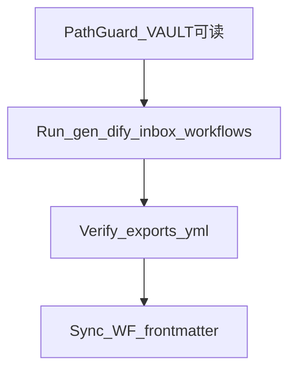

# 用户画像运维 · Tier C 与 Inbox L1/L2 DSL

> **SSOT 位置**：本文件位于真库 `000_Cabinet_System/Skills/02_用户画像运维/`；**不等于** Cursor 编辑器目录 `.cursor/skills`（后者可为薄指针，见内阁 [[Skills/README]] 文首说明）。

**母规范**：[[Infrastructure/AI-OB Skills 应用规范]]。

**配套可视化**：同目录 **[[用户画像运维.canvas]]**（Obsidian Canvas，与本文 SSOT 成对；复杂数据流以本文 + 法典为准）。Mermaid 见下 **「图示（Mermaid）」**。

面向 **Kenny 画像 Tier C** 与 **Inbox L1/L2 Dify 工作流 DSL** 的运维契约：Prompt 真源在 Obsidian，生成入口为 TOOLS 仓库脚本 [`gen_dify_inbox_workflows.py`](file:///Volumes/Cabinet/cabinet/Cursor_Workspace/Internal_Cabinet_Tools/gen_dify_inbox_workflows.py)；**不手搓整包 DSL**，以生成器输出为准。

## 何时使用

- 更新 `小忆_L1_inbox_summary` / `小忆_L2_inbox_enseal_patch` 后需重新导出 Dify YAML。
- 调整 Tier C 知识库绑定、检索 query、或排查「知识检索 / Rerank」相关导入与运行问题。
- 需要对齐 `WF_Inbox_*` 设计文档与 `Dify/_exports/*.yml` 的 Frontmatter 双链。

## 路径安全门（Path Guard）

**在运行生成脚本之前必须完成**（脚本本身不校验挂载，误路径会导致失败、空文件或写到错误副本）：

1. 打开 TOOLS 内 `gen_dify_inbox_workflows.py`，确认顶部 `VAULT = Path(...)`（若未来改为环境变量则读该变量）。
2. 确认该路径**存在**且为**当前本会话使用的真库根**（常见为 `/Volumes/Cabinet/cabinet/obsidian_vault/000_Cabinet_System` 或你的等价挂载）。盘符未挂载、路径不存在时：**不得**执行 `main()`。
3. 自检：`VAULT/Agent/小忆/小忆_L1_inbox_summary.md` 与 `小忆_L2_inbox_enseal_patch.md` 应可读；缺失则先修正路径或挂载后再继续。

## 同步三部曲（Run / Verify / Sync）

默认每次生成 DSL 后执行完整三步；若用户明确只要 yml、不更新设计文档，可豁免 Sync。

| 阶段 | 动作 |
|------|------|
| **Run** | 在 Path Guard 通过后执行：`python3 Internal_Cabinet_Tools/gen_dify_inbox_workflows.py`（需对 `VAULT` 下 `Dify/_exports` 有写权限）。 |
| **Verify** | 检查 `{VAULT}/Dify/_exports/` 下 `wf_inbox_l1_summary_{EXPORT_TAG}.yml` 与 `wf_inbox_refine_patch_{EXPORT_TAG}.yml` 已更新（mtime、非零大小）；可抽查文件头含 `app:`、`workflow:`。 |
| **Sync** | 更新真库设计稿 Frontmatter：`dify_exported_at`（UTC ISO 8601）；若 `EXPORT_TAG` 或文件名变更则同步 `dify_artifact`。涉及：`Dify/01_Ingest_&_Memory/WF_Inbox_L1_Summary.md`、`WF_InboxRefine_Patch.md`（与 Manuals §5.1 双链一致）。若约定影子镜像 `Internal_Cabinet_Tools/000_Cabinet_System 1/` 与真库对齐，则对镜像中同名 `WF_*.md` 同步。工具链变更时追加 TOOLS 仓库 `Internal_Cabinet_Tools/CHANGELOG.md`（影子索引）。 |

## 图示（Mermaid）

## 生成入口与真源（事实表）

| 项 | 值 |
|----|-----|
| 脚本 | `Internal_Cabinet_Tools/gen_dify_inbox_workflows.py` |
| 当前脚本内 `VAULT` | `/Volumes/Cabinet/cabinet/obsidian_vault/000_Cabinet_System` |
| Prompt 真源 | `VAULT/Agent/小忆/小忆_L1_inbox_summary.md`、`小忆_L2_inbox_enseal_patch.md`（生成时剔除文内「## Dify / DSL 配对（运维速查）」整段） |
| 导出目录 | `VAULT/Dify/_exports/` |
| 文件名 | `wf_inbox_l1_summary_{EXPORT_TAG}.yml`、`wf_inbox_refine_patch_{EXPORT_TAG}.yml`；`EXPORT_TAG` 见脚本常量，改批次需改脚本并重新 Run/Verify/Sync |
| Tier C Dataset | `dataset-SLkcbzIPqlKfRjql3OH3JQKF`（须与 Registry / WF §3.6 一致） |
| 图结构 | Start → knowledge-retrieval（Tier C）→ LLM（`context` ← 节点 `result`，User 含 `{{#context#}}`）→ End |

## L1 / L2 差异（速查）

| 工作流 | 知识检索 query 变量 | End 输出变量 |
|--------|---------------------|--------------|
| L1（WF_Inbox_L1_Summary） | `dialogue_excerpt` | `l1_summary_markdown` |
| L2（WF_InboxRefine_Patch） | `l1_summaries_bulk` | `l2_patch_markdown` |

## 硬约束：无 Rerank 模型

- 知识检索节点为 `retrieval_mode: multiple`，`multiple_retrieval_config` 必须包含 **`reranking_enable: false`** 与 **`reranking_mode: weighted_score`**（与 Dify 控制台「加权分数」一致）。仅设 `reranking_enable: false` 不足以通过部分版本的前端校验。
- 手改 YAML 时勿删除上述字段，否则可能再次提示必须配置 Rerank 模型。

## 外链索引

见同目录 [[用户画像运维_外链索引]]。
